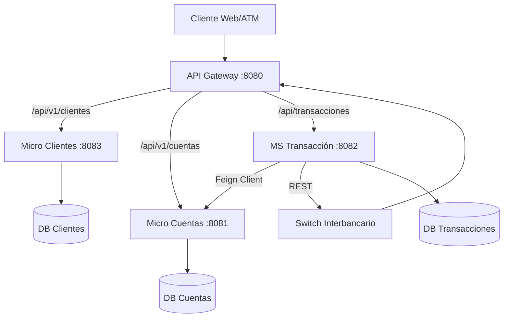

# Documentación Técnica del Proyecto ARCBANK (Banca 2da Generación)
**Fecha de Actualización**: 20 de Enero de 2026
**Versión**: 2.0 (Deep Analysis)

## 1. Visión General del Negocio
Arcbank es una plataforma bancaria moderna diseñada bajo una arquitectura de microservicios. Su objetivo principal es ofrecer servicios financieros robustos (Depósitos, Retiros, Transferencias) con capacidad de interoperabilidad bancaria a través de un Switch Transaccional (DIGICONECU).

El sistema separa claramente la gestión de usuarios (Información PII) de los saldos financieros (Ledger) y la lógica transaccional, garantizando desacoplamiento y escalabilidad.

---

## 2. Arquitectura de Microservicios

El ecosistema se compone de 5 núcleos principales, orquestados mediante Docker Compose.

### Diagrama de Comunicación

### Inventario de Servicios

| Servicio | Puerto Interno | Puerto Host (Docker) | Base de Datos | Responsabilidad Principal |
| :--- | :--- | :--- | :--- | :--- |
| **API Gateway** | 8080 | **4080** | N/A | Enrutamiento centralizado, manejo de CORS, seguridad perimetral. |
| **Micro Clientes** | 8080 | **4083** | `microcliente` | "Know Your Customer" (KYC). Gestiona Personas, Empresas y Auth básico. |
| **Micro Cuentas** | 8081 | **4081** | `db_cuentas` | Ledger bancario. Gestiona Saldos, Tipos de Cuenta y bloqueos. |
| **MS Transacción** | 8080 | **4082** | `db_transacciones` | Orquestador de movimientos monetarios. Lógica de negocio core (Débito/Crédito). |
| **Sucursales** | 8080 | N/A | N/A | *En desarrollo*. Código fuente presente pero no desplegado en Docker. |

---

## 3. Análisis Profundo de Componentes

### A. Micro Clientes (`com.arcbank.MicroCliente`)
Este servicio es la autoridad única sobre la identidad del usuario.
*   **Modelo de Datos**:
    *   `Cliente`: Entidad raíz. Atributos: `identificacion` (Unique Index), `clave`, `estado`.
    *   `Persona`: Datos naturales (Nombre, Apellido, Género).
    *   `Empresa`: Datos jurídicos (Razón Social, RUC).
*   **Autenticación**:
    *   Implementa un login directo (`/login`) que valida `identificacion` + `clave`. No usa OAuth2/JWT por el momento (Auth básica stateful o stateless simple).
*   **Curiosidad**: El servicio es autónomo y no se conecta con Cuentas. Es el Frontend quien orquesta la llamada: Primero Login -> Obtiene ID -> Busca Cuentas de ese ID.

### B. Micro Cuentas (`com.arcbank.cuenta`)
El corazón financiero. Es el único servicio con permiso de escritura sobre los saldos.
*   **Modelo de Datos**:
    *   `CuentaAhorro`: 
        *   `numeroCuenta`: Unique String (20 chars).
        *   `saldoActual` / `saldoDisponible`: BigDecimal.
        *   `idCliente`: Referencia lógica (sin FK física) al Micro Clientes.
*   **Endpoint Crítico**:
    *   `PUT /api/v1/cuentas/ahorros/{id}/saldo`: Endpoint "protegido" (lógicamente) usado exclusivamente por `MS Transacción` para actualizar saldos. Recibe un delta y lo suma/resta.
    *   **Validación**: Si el saldo resultante < 0, lanza `BusinessException("Fondos insuficientes")`.

### C. MS Transacción (`com.arcbank.cbs.transaccion`)
El cerebro de operaciones. No tiene saldo propio, sino que orquesta los movimientos en `Micro Cuentas`.
*   **Patrón de Diseño**: Saga Orchestrator (simplificado).
*   **Modelo de Datos (`Transaccion`)**:
    *   `tipoOperacion`: DEPOSITO, RETIRO, TRANSFERENCIA_INTERNA, TRANSFERENCIA_SALIDA, TRANSFERENCIA_ENTRADA.
    *   **Balance Dual (Feature Clave)**:
        *   `saldoResultante`: Guarda el saldo post-operación de la cuenta ORIGEN.
        *   `saldoResultanteDestino`: Guarda el saldo post-operación de la cuenta DESTINO (solo en transferencias internas).
        *   *Lógica*: Permite que al consultar el historial, tanto el remitente como el destinatario vean SU propio saldo final en ese momento histórico.
*   **Lógica de Transferencia Interna**:
    1. Valida cuentas Origen y Destino.
    2. Llama a Micro Cuentas -> Debitar Origen.
    3. Llama a Micro Cuentas -> Acreditar Destino.
    4. Guarda Transacción con ambos saldos resultantes.

### D. Micro Sucursales (`com.arcbank.sucursales`)
**Estado**: *Presente en código, despliegue separado.*
Este servicio introduce **MongoDB** al ecosistema para manejar datos geoespaciales y jerárquicos.
*   **Base de Datos**: `db_sucursales` (MongoDB).
*   **Modelo de Datos (`Sucursal`)**:
    *   Documento flexible con `ubicacion` (Provincia, Cantón, Parroquia) y coordenadas (`latitud`, `longitud`).
    *   Maneja lógica de **Feriados Bancarios** según la localidad (Nacional vs Local).
*   **Endpoints Clave**:
    *   `GET /api/sucursales/v1/sucursales/provincia/{provincia}`
    *   `GET /api/sucursales/v1/sucursales/{codigo}/feriados`: Retorna días no laborables específicos para esa sucursal.
*   **Despliegue**:
    *   Tiene su propio `docker-compose.yml` dentro de `/sucursales`.
    *   No se levanta automáticamente con el comando principal del root. Requiere levantar MongoDB por separado o integrar el compose.

---

## 4. Integración Switch Interbancario (ISO 20022)

El sistema soporta interoperabilidad mediante el estándar simulado ISO 20022.

### Flujo Saliente (Outbound)
1. **Inicio**: User solicita `TRANSFERENCIA_SALIDA`.
2. **Débito Local**: `MS Transacción` debita la cuenta local en `Micro Cuentas`.
3. **Llamada Switch**: Se construye un `TxRequest` y se envía a `POST /api/v2/transfers` del Switch.
    *   *Datos*: Debtor (Origen), Creditor (Destino Externo), Amount, TargetBank.
4. **Manejo de Error**: Si el Switch responde Error o TimeOut, se ejecuta un **Reverso Automático** (Compensación) devolviendo el dinero a la cuenta local.

### Flujo Entrante (Inbound - Webhook)
El sistema expone un endpoint para recibir dinero de otros bancos.
*   **Endpoint**: `POST /api/core/transferencias/recepcion` (`WebhookController`).
*   **Lógica de Procesamiento**:
    1. **Validación**: Verifica `instructionId` (ID único del switch), cuenta destino y monto.
    2. **Idempotencia**: Busca en DB si ya existe una transacción con ese `referencia = instructionId`. Si existe, retorna 200 OK (ACK) sin procesar de nuevo.
    3. **Acreditación**: Llama a `Micro Cuentas` para sumar el saldo.
    4. **Persistencia**: Guarda la transacción como `TRANSFERENCIA_ENTRADA` con estado `COMPLETADA`.
    5. **Respuesta**: Retorna JSON con status `ACK` para confirmar recepción al Switch.

---

## 5. Aplicaciones Frontend

### A. Frontend Web (Banca Personas - Puerto 4000)
*   **Tecnología**: React + Vite.
*   **Funcionalidad**: Dashboard de usuario completo. Permite ver movimientos coloreados (Verde=Ingreso, Rojo=Egreso).
*   **Navegación**: Utiliza `Sidebar.jsx` para acceso rápido a Transferencias Interbancarias.

### B. Frontend Cajero (ATM - Puerto 4001)
*   **Tecnología**: React + Vite + Tailwind.
*   **Simulación**: Emula un cajero físico.
*   **Búsqueda Híbrida**: Permite buscar usuarios por Cédula O Número de Cuenta para iniciar operaciones de ventanilla (Depósitos/Retiros en efectivo).

---

## 6. Bases de Datos y Persistencia
Cada microservicio es dueño de su esquema (Database-per-service pattern).

1.  **db_clientes** (`microcliente`):
    *   Tablas: `cliente`, `persona`, `empresa`, `empresa_representante`.
2.  **db_cuentas** (`db_cuentas`):
    *   Tablas: `cuenta_ahorro`, `tipo_cuenta_ahorro`, `tasa_interes_historial`.
3.  **db_transacciones** (`db_transacciones`):
    *   Tablas: `Transaccion` (Nótese el uso de mayúsculas y comillas en queries para compatibilidad Postgres).

## 7. Notas de Despliegue y Mantenimiento
*   **Arranque**: `docker-compose up --build -d` inicia todo el ecosistema.
*   **Healthchecks**: Los servicios dependen de que sus DBs estén "healthy" (`pg_isready`) antes de iniciar.
*   **Puertos Expuestos**:
    *   Web: http://localhost:4000
    *   ATM: http://localhost:4001
    *   Gateway (API pública): http://localhost:4080
